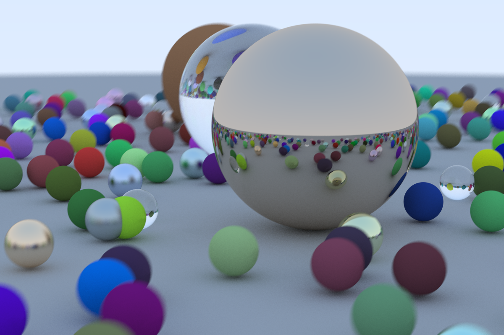

按照[Ray Tracing in One Weekend](https://raytracing.github.io/books/RayTracingInOneWeekend.html)实现的软光线追踪。

总体的逻辑大致是一样的，一些原文中解释不是很清楚的地方添加了很多注释，有的还有参考链接。

需要参考的话可以按照 commit history 从前往后看。

大修改：

1. 向量类复用了自己之前写软渲染器的时候写的模板类。软渲染器全是 float，这次全是 double。
2. 改成了**多线程**。根据 CPU 的逻辑核心数创建线程，8 核 16 线程的 Ryzen 3700X 跑最终场景 10 分钟左右。

小修改：

1. 用了文件流和 string 流，不需要像原文那样重定向。
2. 有几处用了 C++ 20 的特性，所以只支持 C++ 20。
3. 修改了一些类，函数，变量，类成员变量的命名。
4. 修改了几处小逻辑，更清晰一些。
5. 添加了很多注释。